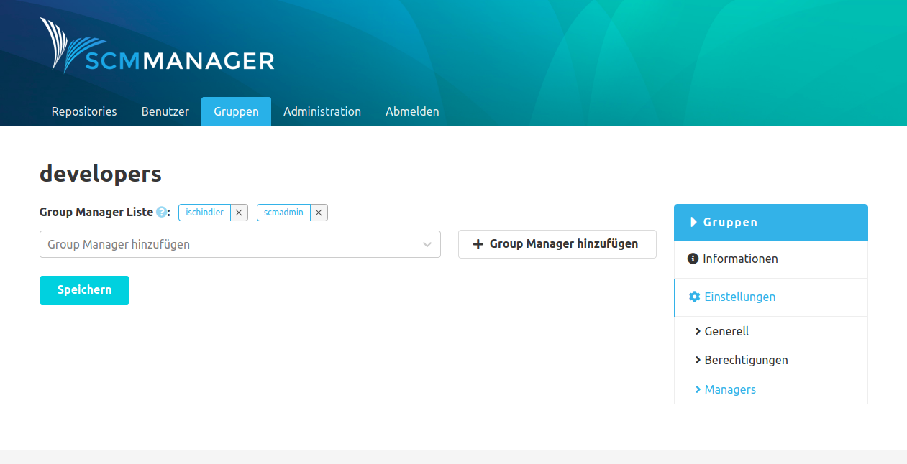

Durch die Installation des Plugins wird für alle Gruppen in der Gruppen Navigation ein neuer Eintrag "Managers" angelegt. Dort können einer Gruppe Gruppenmanager zugewiesen werden, die wiederum Benutzer zu Gruppen hinzufügen können. 

Abhängig von den Benutzerberechtigungen unterscheidet sich der Inhalt der Seite Gruppen:

* Administratoren können alle SCM-Manager-Gruppen sehen
* Gruppenmanager können alle von ihnen verwaltete Gruppen sehen
* Normalen Benutzern wird der Gruppenreiter erst gar nicht angezeigt
