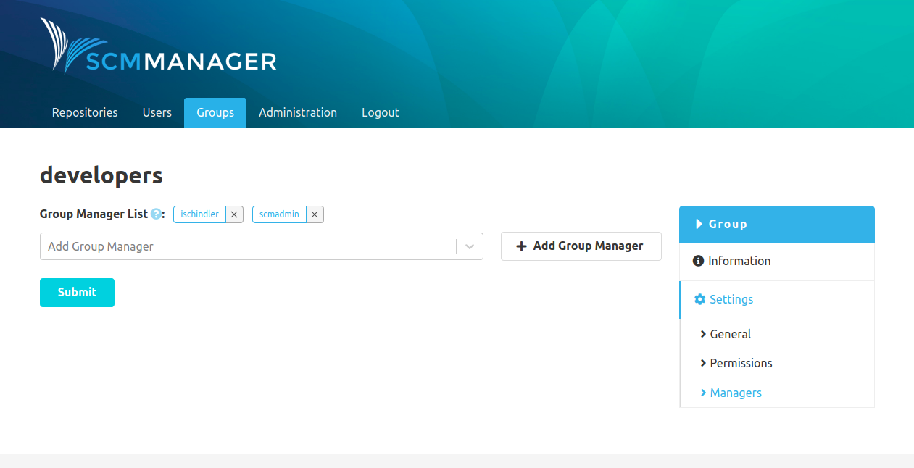

Once the plugin is installed, there is an additional item named "Managers" in the settings of groups. There, managers for the group can be added. The managers in turn can add users to the group.

Depending on the permissions of users, the content of the "Groups" page differs:

* Administrators can see all groups that exist in SCM-Manager
* Group managers can see all groups that they are managers of
* Normal users can't see the "Groups" menu item at all
